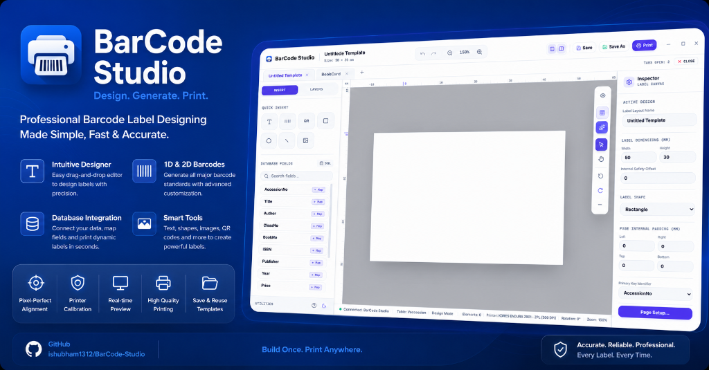

# BarCode Studio
<p align="center">
  
</p>

Barcode Studio v3 is a state-of-the-art desktop label-designing and printing application. Built on **React, TypeScript, Electron, and Python**, it bridges the ease of modern web layouts with high-resolution, pixel-perfect GDI+ hardware printing. It also features a fully-automated **Gmail Print Daemon** to process print commands straight from your inbox.

---

## 🚀 Key Features

### 🎨 WYSIWYG Designer Canvas
- Drag-and-drop designer for text, custom shapes, lines, images, barcodes, and QR codes.
- Floating-point coordinates for layout calculations, ensuring sub-pixel layout alignment before final rasterization.

### 🖨️ High-Resolution GDI+ Printing Pipeline
- **Auto-DPI Detection**: Detects and uses the highest native printer DPI (e.g., 600, 300, 203 DPI) for 1:1 pixel-perfect bitmap rendering.
- **Content-Aware Rendering Hints**:
  - `ClearTypeGridFit` / `AntiAliasGridFit` for high-contrast text.
  - `HighQualityBicubic` interpolation for raster photographs.
  - `NearestNeighbor` (no interpolation) for barcodes and QR codes to keep lines sharp and scan-ready.
- **Monochrome Thermal Dithering**: Custom hard-threshold black & white conversion for thermal labels.
- **Native Driver Mode**: Optional bypass using raw ZPL/TSPL/EPL drivers for high-speed industrial printing.

### 🌍 Universal Unicode & Multi-Language Rendering
- Out-of-the-box support for complex shaping scripts like **Hindi, Tamil, Telugu, Arabic**, alongside **Japanese, Chinese, Korean (CJK)**, and standard Latin.
- Language-smart font auto-override logic maps unsupported fonts to high-fidelity regional TrueType/OpenType files.

### 💾 Dynamic Database Binding
- Multi-engine support: **SQLite, MySQL, and MS SQL Server**.
- Case-insensitive field resolution (bind `Title` in templates to `TITLE`/`title` in tables automatically).
- Heuristic fallback logic for accession number matching.

### ✉️ Gmail Automation Daemon
- Periodically scans a Gmail inbox for specialized subject lines and email print commands.
- Automated accession-to-database lookup, verified sender security filters, and background printing spooler.

### 📊 Advanced Print logs & Analytics
- Complete job ledger showing manual in-app prints vs background email prints.
- Custom grouping for multiple labels (`810612(4)` instead of repeating lines).
- Dynamic date range filter and email sender filter dropdown.

---

## 🛠️ Architecture & Tech Stack
### Frontend
- **Framework**: React 18, TypeScript, Vite
- **Styling**: Vanilla CSS (Metro / Dark-Mode design system)
- **Icons**: Lucide React

### Backend (Desktop Service & Spooler Bridge)
- **Server**: Python 3 (Flask API, PyInstaller bundled)
- **OS Layer**: ctypes bindings to `Gdiplus.dll` and `win32print`/`win32ui` (pywin32) for native Windows GDI printing.
- **Image Processing**: Pillow (PIL)

---

## 📦 Project Directory Structure

```
Barcode Studio v3/
├── React/                      # Electron + React Project Root
│   ├── electron/               # Electron main process and preload script
│   ├── src/                    # Frontend React Components
│   │   ├── components/         # Designer, Print Modals, and History views
│   │   ├── hooks/              # Custom React hooks (electron api bindings)
│   │   └── data/               # Mock values and defaults
│   ├── backend/                # Python local server source
│   │   ├── drivers/            # Printer drivers (GDI, TSPL, ZPL, EPL, PDF)
│   │   ├── services/           # DB lookup, Gmail Polling, Spooler services
│   │   ├── assets/fonts/       # Bundled TTF/TTC files for unicode printing
│   │   └── app.py              # Flask gateway script
│   ├── package.json            # Node scripts and dependencies
│   └── vite.config.ts          # Vite asset bundling rules
└── README.md                   # Repository Guide (this file)
```

---

## 💻 Getting Started (Development Mode)

### Prerequisites
- Node.js (v16+)
- Python (v3.9+) with virtual environment tools.
- Windows Operating System (Required for GDI+ spooling and win32print calls).

### Backend Setup
1. Create a Python virtual environment:
   ```bash
   cd React
   python -m venv .venv
   .venv\Scripts\activate
   ```
2. Install Python dependencies:
   ```bash
   pip install -r requirements.txt
   ```

### Frontend Setup & Execution
1. Install node dependencies:
   ```bash
   npm install
   ```
2. Launch the desktop application:
   ```bash
   npm run electron:dev
   ```

---

## 🚀 Building & Packaging

### 1. Compile the Python Executable
We package the Python runtime using PyInstaller so that the user does not need a local Python installation:
```bash
cd React
pip install pyinstaller
pyinstaller app.spec
```
This outputs `backend/dist/app.exe`.

### 2. Build the Electron Desktop Package
Use electron-builder to compile the React frontend assets and package the Electron app with the compiled Python binary:
```bash
npm run build:electron
npx electron-builder build --win
```
The standalone installer will be output to the `React/dist/` directory.

---

## 📄 License & Terms
Custom library integration software. Created for physical label printing systems.
